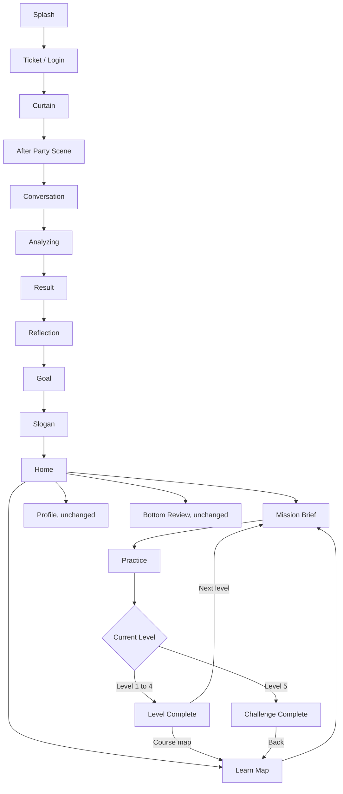
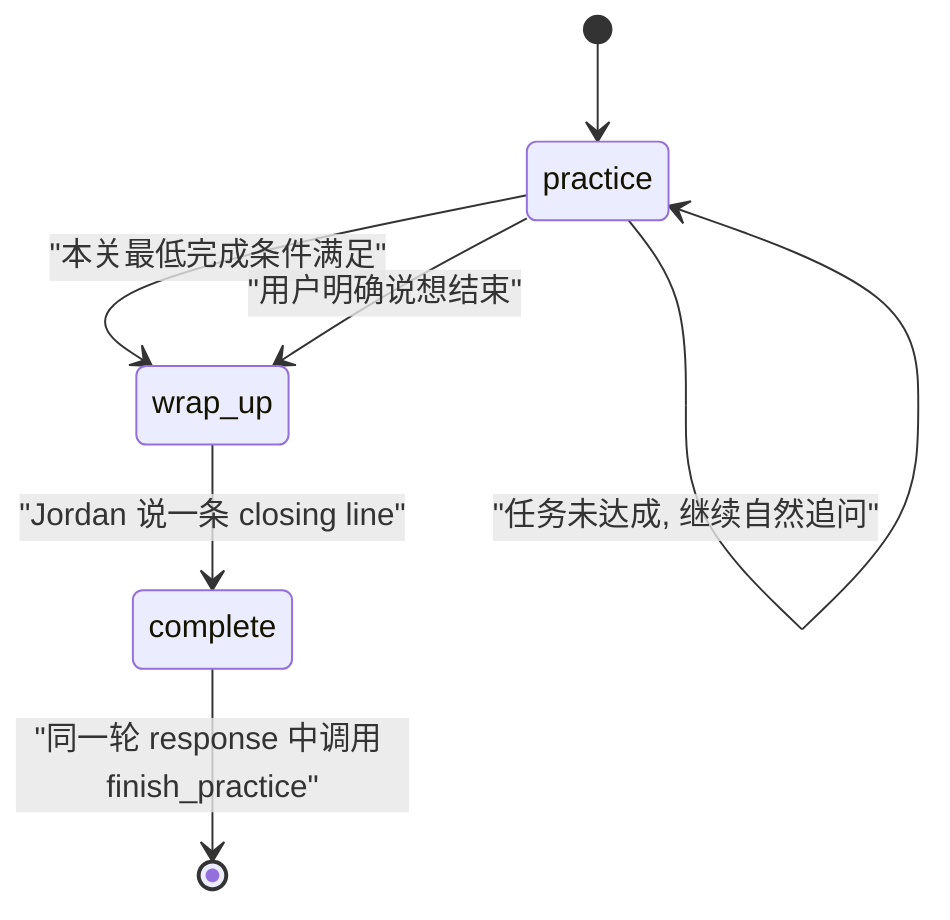

# 自我介绍课程线框操作与 AI Prompt 说明

## 1. 文档目标

这份文档用于对齐当前真实产品逻辑，重点是页面线框、用户操作、跳转关系和 AI 对话 prompt。读者包括产品、美术、前端、对话设计同学。

本文件不是资产生成 brief，也不是新功能方案。它描述当前版本应该如何被理解和验收：

- Onboarding 结束后进入 Home。
- Home 主卡指向当前未完成 Level。
- Learn icon 对应 5 关课程 Map。
- Mission Brief 解释本关任务。
- Practice 执行 Jordan 的英文沉浸对话，页面只显示当前 Level 的一句任务。
- Level 1 到 4 结束后进入普通完成弹层。
- Level 5 结束后进入挑战完成弹层，只显示真实 coffee chat tip 和 Back。
- Profile 不新增 Intro Memory 入口。
- 底部 Review icon 页面保持原架构。

## 2. 总流程图



## 3. 当前数据和解锁逻辑

| 对象 | 当前作用 | 页面使用 |
|---|---|---|
| `CourseProgress` | 当前主题、当前关卡、已完成关卡、最后练习时间 | Home、Learn Map |
| `LessonConfig` | 每关标题、userTask、conversation goal、opening、奖励，tips 仅作内部参考 | Home、Learn Map、Mission、Practice、Complete |
| `IntroMemory` | 存每关沉淀的介绍素材 | Learn Map、Practice prompt |
| `PracticeSessionResult` | 单次练习 transcript、reviewDraft、分数变化 | Complete 和内部记录 |

解锁规则：

- Level 1 默认解锁。
- Level 2 到 4 依赖上一关完成。
- Level 5 只有在 Level 1 到 4 全部完成后解锁。
- 每关完成后会从用户 transcript 中抽取一张 memory card。
- 当前版本没有在完成页做 memory card 确认或微调。

## 4. 页面线框和操作逻辑

### 4.1 Onboarding

当前链路：

```text
┌────────────────────────────┐
│ Splash                     │
└──────────────┬─────────────┘
               ↓
┌────────────────────────────┐
│ Ticket / Login             │
│ 用户入场                   │
└──────────────┬─────────────┘
               ↓
┌────────────────────────────┐
│ Curtain                    │
│ 票根确认, 开幕             │
└──────────────┬─────────────┘
               ↓
┌────────────────────────────┐
│ After Party + Conversation │
│ 用户完成第一段社交体验     │
└──────────────┬─────────────┘
               ↓
┌────────────────────────────┐
│ Analyzing / Result         │
│ Reflection / Goal / Slogan │
└──────────────┬─────────────┘
               ↓
┌────────────────────────────┐
│ Home                       │
└────────────────────────────┘
```

用户看到：

- 票根、开幕、派对、分析、结果、反思、目标和 slogan。
- 这是进入产品的剧场隐喻铺垫。

用户操作：

- 按页面引导完成选择。
- Goal 选择后进入 Slogan，Slogan 自动进入 Home。

Prompt 责任：

- Onboarding 当前不是本课程 Jordan prompt 的执行位置。
- 它只生成 onboarding profile，用于后续初始偏好和练习气质。

不要做：

- 不在 onboarding 里直接展示 5 关课程 Map。
- 不在 onboarding 里提前进入 Level 1 对话。

### 4.2 Home

线框：

```text
┌────────────────────────────┐
│ U  Max           streak pts│
│                            │
│ ┌────────────────────────┐ │
│ │ TODAY'S REHEARSAL      │ │
│ │ Level N                │ │
│ │ 当前 Level title       │ │
│ │ 当前 Level subtitle    │ │
│ │ [Curtain up]           │ │
│ └────────────────────────┘ │
│                            │
│ Luna 鼓励气泡              │
│                            │
│ Networking Modules         │
│ ┌────────────────────────┐ │
│ │ LinkedIn Opener        │ │
│ │ [Rehearse]             │ │
│ └────────────────────────┘ │
│ ┌────────────────────────┐ │
│ │ AI PM Coffee Chat      │ │
│ │ [Rehearse]             │ │
│ └────────────────────────┘ │
│                            │
│ [home] [learn] [review] [profile]
│ icon only, active underline│
└────────────────────────────┘
```

用户看到：

- 顶部积分和 streak。
- 今日排练主卡，显示当前未完成 Level。
- Luna 鼓励气泡。
- 原来的 Networking Modules 列表。
- 底部 icon-only nav，没有 tab 文案。

用户操作和跳转：

| 操作 | 跳转 |
|---|---|
| 点击主卡 `Curtain up` | 当前 Level 的 Mission Brief |
| 点击任意 Networking Module 的 `Rehearse` | 当前 Level 的 Mission Brief |
| 点击 Learn icon | Learn Map |
| 点击 Review icon | 原有底部 Review 页面 |
| 点击 Profile icon | 原有 Profile 页面 |

Prompt 责任：

- Home 不执行 AI prompt。
- Home 只负责决定当前要进入哪个 Level。

不要做：

- 不展示 `Jordan is waiting`。
- 不展示 Home 里的 `Intro Memory` 摘要。
- 不新增 Profile 入口卡。
- 不给底部 nav 增加文字标签。

### 4.3 Learn Map

线框：

```text
┌────────────────────────────┐
│ YOUR REHEARSAL MAP         │
│ Alumni coffee intro        │
│ 2/5 levels completed       │
│                            │
│ ┌──── folder stack ──────┐ │
│ │ Level 1  Equal exchange│ │
│ │ Done                   │ │
│ │ Memory line            │ │
│ └────────────────────────┘ │
│ ┌──── folder stack ──────┐ │
│ │ Level 2 Professional   │ │
│ │ Active / Start         │ │
│ │ Memory slot waiting    │ │
│ └────────────────────────┘ │
│ ┌──── locked folder ─────┐ │
│ │ Level 5 Challenge      │ │
│ │ Locked                 │ │
│ └────────────────────────┘ │
│                            │
│ Intro Memory shelf         │
└────────────────────────────┘
```

用户看到：

- 5 个 folder 节点。
- 每关状态：Done、Locked、Start 或当前 active。
- 每关 memory line。
- 底部 Intro Memory shelf，只在 Learn 页面存在。

用户操作和跳转：

| 操作 | 结果 |
|---|---|
| 点击已解锁 Level | 进入该 Level 的 Mission Brief |
| 点击 locked Level | 不跳转 |
| Level 1 到 4 完成后返回 | 对应节点变 Done，下一关可 Start |
| Level 1 到 4 都完成 | Level 5 解锁 |

Prompt 责任：

- Learn Map 不执行 AI prompt。
- 它展示每关沉淀出来的 memory line，帮助用户理解自己已准备了什么。

不要做：

- 不新增单独 Map tab。
- Learn icon 就是 Map 入口。
- 不把 Profile 改造成课程主页。

### 4.4 Mission Brief

线框：

```text
┌────────────────────────────┐
│ <  LEVEL N REHEARSAL       │
│    Level title             │
│                            │
│ ┌────────────────────────┐ │
│ │ Coffee visual          │ │
│ │ Jordan Lee             │ │
│ │ Alumni mentor          │ │
│ └────────────────────────┘ │
│                            │
│ Today's task               │
│ 一句简单目标               │
│                            │
│ [Curtain up]               │
└────────────────────────────┘
```

用户看到：

- 当前 Level 编号和标题。
- Jordan Lee，身份是 `Alumni mentor · Applied AI PM`。
- 顶部 coffee visual。
- 一张 `Today's task` 卡片，只显示一句本关目标。

用户操作和跳转：

| 操作 | 跳转或行为 |
|---|---|
| 点击返回 | 回 Home |
| 点击 `Curtain up` | 进入 Practice |

Prompt 责任：

- Mission Brief 把本关任务说给用户听。
- 它不触发 Jordan 对话。
- 它不展示 tips、success criteria、current draft 或奖励信息。
- 第四关的 polished intro 不在 Mission 或 Practice 展示。

不要做：

- 不在 Mission 里打分。
- 不在 Mission 里做完整复盘。
- 不随机切换 Jordan。
- 不把内部参考写成 Jordan 会说出来的话。
- 不展示 `Scene / Support / Reward`。
- 不展示 `What to include` 或 `Success check`。

### 4.5 Practice

线框：

```text
┌────────────────────────────┐
│ Level N task panel v       │
│ current Level userTask     │
│                            │
│ Jordan Lee                 │
│ ┌────────────────────────┐ │
│ │ assistant or user text │ │
│ └────────────────────────┘ │
│                            │
│ [X]   [Tap to speak]   [Pause]
└────────────────────────────┘
```

用户看到：

- 练习背景图。
- 顶部任务列表，可以收起，只显示当前 Level 的一句目标。
- Jordan Lee 名称。
- 所有 Level 都不显示 Tips 卡。
- Level 4 不显示 polished intro 卡。
- 当前 assistant 或 user bubble。
- 底部退出、语音、暂停按钮。

用户操作和跳转：

| 操作 | 行为 |
|---|---|
| 按语音按钮 | 开始用户 turn |
| 松开语音按钮 | 发送用户 turn |
| 点击 Pause | 暂停语音输入，显示 Resume |
| 点击 X | 打开 End practice 确认弹层 |
| End practice 选择 Continue | 回到练习 |
| End practice 选择 End | 回 Home，不算完成 |
| Jordan 自然完成本关 | 等 closing line 播完，再进入 Complete |

Prompt 责任：

- Practice 是唯一真正执行 Jordan system prompt 的课程页面。
- 对话全英文沉浸。
- Jordan 不评分，不复盘，不解释系统规则。
- Jordan 不给句型、模板、训练技巧或成功标准。
- 用户卡住时，Jordan 只像真实 alumni 一样换一个更容易回答的问题。
- 不直接替用户完成整段介绍。

不要做：

- 不在 Practice 中显示分数。
- 不在 Practice 中显示评价。
- 不因沉默、单词回答、跑题直接完成。
- 不在 closing line 播放前跳完成页。

### 4.6 Level Complete, Level 1 到 4

线框：

```text
┌────────────────────────────┐
│ blurred dark background    │
│                            │
│ ┌────────────────────────┐ │
│ │ Level Complete         │ │
│ │                        │ │
│ │ blue diamond +20       │ │
│ │ fire icon streak +1    │ │
│ │                        │ │
│ │ [Course map] [Next level]
│ └────────────────────────┘ │
└────────────────────────────┘
```

用户看到：

- 白色半透明完成弹层。
- 标题 `Level Complete`。
- 蓝钻奖励 `+20`、`+25` 或 `+30`，不显示 `pts`。
- `streak +1`。
- 两个按钮：`Course map` 和 `Next level`。

用户操作和跳转：

| 操作 | 跳转 |
|---|---|
| 点击 `Course map` | 回 Home，并打开 Learn Map tab |
| 点击 `Next level` | 进入下一关 Mission Brief |

Prompt 责任：

- Complete 不执行 prompt。
- Complete 不做复盘，不评价表现。
- 完成时内部会写入 progress、score、streak 和 memory card。

不要做：

- 不展示 review 按钮。
- 不展示 memory card 微调。
- 不加小字 subtitle。

### 4.7 Challenge Complete, Level 5

线框：

```text
┌────────────────────────────┐
│ blurred dark background    │
│                            │
│ ┌────────────────────────┐ │
│ │ Challenge Complete     │ │
│ │                        │ │
│ │ blue diamond +50       │ │
│ │ fire icon streak +1    │ │
│ │                        │ │
│ │ Try it in one real     │ │
│ │ coffee chat            │ │
│ │                        │ │
│ │ [Back]                 │ │
│ └────────────────────────┘ │
└────────────────────────────┘
```

用户看到：

- 标题 `Challenge Complete`。
- 蓝钻奖励 `+50`，不显示 `pts`。
- `streak +1`。
- 黄色 tip：`Try it in one real coffee chat`。
- 单个 `Back` 按钮。

用户操作和跳转：

| 操作 | 跳转 |
|---|---|
| 点击 `Back` | 回 Home，并打开 Learn Map tab |

Prompt 责任：

- Complete 不执行 prompt。
- 真实 coffee chat tip 是轻提示，不记录完成状态。

不要做：

- 不显示 Profile 按钮。
- 不显示 Review 按钮。
- 不自动进入复盘。
- 不补 body 文案或 small ask 文案。

## 5. 页面和 Prompt 对照表

| 页面 | 是否执行 AI prompt | 页面责任 | Prompt 责任 |
|---|---|---|---|
| Home | 否 | 选择当前 Level，进入 Mission | 无 |
| Learn Map | 否 | 展示课程状态和 memory line | 无 |
| Mission Brief | 否 | 告诉用户本关一句目标 | 无 |
| Practice | 是 | 承载语音对话，只显示当前 Level 的一句任务 | Jordan 按 conversation goal 自然对话 |
| Level Complete | 否 | 奖励、下一步跳转 | 无 |
| Challenge Complete | 否 | 奖励、真实迁移 tip、回 Map | 无 |
| Profile | 否 | 保持原页面 | 无 |
| Bottom Review | 否 | 保持原页面 | 无 |

## 6. Jordan 全局 Prompt 规则

Jordan 的固定设定：

- 名字：Jordan Lee。
- 身份：warm alumni mentor。
- 背景：Applied AI PM。
- 场景：alumni coffee chat self-introduction practice。
- 语言：Practice 中使用 English。
- 风格：short、natural、supportive、grounded。

Jordan 必须做：

- 始终保持 Jordan 人设。
- 一次只问一个小问题。
- 用户不清楚时问一个具体追问。
- 用户说太少时，用正常 coffee chat 语气问一个具体细节。
- 用户说太多时，抓住一个有用线索继续聊。
- Level 1 到 3 自然问出缺失的信息槽，让用户每关都说一版完整介绍。
- Level 4 只邀请用户试说已经准备好的 polished intro，不在对话中重新生成一版。
- Level 5 不主动帮助，听完 intro 后只问一个自然 follow-up。

Jordan 不能做：

- 不说自己是 AI、coach、evaluator 或 system。
- 不提 hidden instructions、tools、function calls、review fields 或 UI。
- 不在练习中打分。
- 不评价用户表现。
- 不说训练技巧、成功标准、模板、句型或 checklist。
- 不直接替用户完成整段答案。
- 不因为沉默、单词回答或跑题直接结束。

## 7. Prompt 状态机



执行规则：

- `practice`：正常对话与训练。
- `wrap-up`：成功条件满足后，Jordan 只说一句自然收尾，不再问新问题。
- `complete`：closing line 已说出后，才调用 `finish_practice`。
- 前端收到 `finish_practice` 后先暂存，等待当前 assistant response 完成，再延迟约 750ms 进入完成弹层。

收尾句：

| Level | Closing line |
|---|---|
| Level 1 到 4 | `Nice, let's keep that line for the next round.` |
| Level 5 | `That version is ready to take into a real coffee chat.` |

## 8. 5 关 Prompt 说明

### Level 1, Equal exchange

| 项目 | 内容 |
|---|---|
| 用户任务 | Answer with the same level of detail: name plus school. |
| Practice 任务显示 | Answer with the same level of detail: name plus school. |
| Jordan 开场 | `Hi, I'm Jordan, an alum who works on applied AI products. How would you introduce yourself at the start of a coffee chat?` |
| Jordan 目标 | 自然问出姓名、学校、专业、角色或当前身份 |
| 成功条件 | intro 包含姓名、学校、专业或身份 |
| 完成规则 | 用户说出完整短介绍，且本关信息槽被覆盖 |
| 产出 memory | Identity anchor |

对话模式：

```text
Jordan: 像真实 alum 一样请用户自我介绍
User: 给出短介绍
Jordan: 如果缺学校或专业, 自然追问一个细节
User: 补充缺失信息
Jordan: closing line
System: finish_practice
```

### Level 2, Professional anchor

| 项目 | 内容 |
|---|---|
| 用户任务 | Add one more detail about your major or work direction. |
| Practice 任务显示 | Add one more detail about your major or work direction. |
| Jordan 开场 | `Good to see you again. If this were a coffee chat, how would you introduce yourself and what you are working on or exploring now?` |
| Jordan 目标 | 自然问出用户现在在做什么，实习、项目、研究、工作或探索方向都可以 |
| 成功条件 | intro 包含身份和当前项目、工作、研究或探索方向 |
| 完成规则 | 用户说出完整介绍，且当前方向被覆盖 |
| 产出 memory | Professional anchor |

对话模式：

```text
Jordan: 邀请用户完整介绍并说现在在做什么
User: 说身份和方向
Jordan: 如果缺当前项目或工作, 问一个自然 follow-up
User: 补充一个具体方向
Jordan: closing line
System: finish_practice
```

### Level 3, Curiosity hook

| 项目 | 内容 |
|---|---|
| 用户任务 | Add one personal hook and a light reason to keep talking. |
| Practice 任务显示 | Add one personal hook and a light reason to keep talking. |
| Jordan 开场 | `Let's make this feel like a real alumni chat. How would you introduce yourself, and what would you be curious to ask me about?` |
| Jordan 目标 | 自然问出用户的兴趣动机和 light ask |
| 成功条件 | 用户说出完整 intro、具体动机和轻量 small ask |
| 完成规则 | 用户的 30 秒版本已包含身份、方向、动机和 small ask |
| 产出 memory | Curiosity hook，并同步成 nextSmallAsk |

对话模式：

```text
Jordan: 邀请用户完整介绍并说想问什么
User: 说 30 秒版本
Jordan: 如果缺动机或 small ask, 像 alum 一样追问
User: 补充动机或小问题
Jordan: closing line
System: finish_practice
```

### Level 4, Mirror polish

| 项目 | 内容 |
|---|---|
| 用户任务 | Try the polished version and make it sound like you. |
| Practice 任务显示 | Try the polished version and make it sound like you. |
| Jordan 开场 | `This time, try your prepared intro in your own voice. I'll listen like this is the start of a real coffee chat.` |
| Jordan 目标 | 只邀请用户试说已经准备好的 polished intro，不现场生成新版本 |
| 成功条件 | 用户尝试完整版本，保留个人细节，听起来自然 |
| 完成规则 | 用户试说完整 intro 后，Jordan 自然回应并收尾 |
| 产出 memory | Customized intro v1 |

对话模式：

```text
Jordan: 邀请用户试说已经准备好的 polished version
User: 说准备好的 polished version 或自己的改写
Jordan: 像真实 alum 一样自然回应
Jordan: closing line
System: finish_practice
```

Level 4 重要边界：

- 当前 Practice 不渲染 polished intro 卡。
- Jordan 不能在对话里重新生成 polished intro。

### Level 5, No-hint challenge

| 项目 | 内容 |
|---|---|
| 用户任务 | Do the challenge from memory, without hints. |
| Jordan 开场 | `Challenge round. Imagine this is the start of our alumni coffee chat. Go ahead with your full intro when you are ready.` |
| Practice 任务显示 | Do the challenge from memory, without hints. |
| Jordan 目标 | 听完用户完整 intro，然后问一个自然 follow-up |
| 成功条件 | 用户完成 30 到 45 秒 intro，回答一个 follow-up，intro 能在真实 alumni coffee chat 复用 |
| 完成规则 | 用户完成 intro 且回答一个追问后，才能结束 |
| 产出 memory | Final intro |

对话模式：

```text
Jordan: 邀请用户直接开始完整 intro
User: 说 30 到 45 秒 intro
Jordan: 问一个自然 follow-up
User: 回答 follow-up
Jordan: closing line
System: finish_practice
```

Level 5 重要边界：

- 用户只说 intro 但没回答追问时，不能结束。
- 用户卡住时，Jordan 不能给模板或完整答案。
- 完成页只显示真实 coffee chat tip 和 Back。

## 9. 失败和卡住路径

| 用户状态 | Jordan 行为 | 是否完成 |
|---|---|---|
| 沉默 | 换一个更容易回答的自然问题 | 否 |
| 单词回答 | 要一个具体细节 | 否 |
| 跑题 | 轻轻拉回本关任务 | 否 |
| 焦虑或说不会 | 承认感受，再问一个更小的问题 | 否 |
| 明确说想结束 | 给 supportive closing line 后结束 | 是，轻量完成 |
| 安全边界风险 | 退出角色，给安全提醒后结束 | 是 |

## 10. 当前验收 Checklist

- Home 主卡点击后进入当前 Level Mission。
- Home 下半区仍是 Luna 鼓励气泡和 Networking Modules。
- 底部 nav 只有 icon 和 active underline，没有文字标签。
- Learn icon 进入 5 关 Map。
- Locked Level 不能进入。
- Level 5 只在 Level 1 到 4 完成后解锁。
- Mission 展示 Jordan 和一句 Today's task。
- Practice 中所有 Level 都不显示 Tips 卡或 polished intro 卡。
- Practice 左上任务列表只显示当前 Level 的一句目标。
- Jordan prompt 不包含 UI tips、模板、checklist 或句型提示。
- Jordan closing line 播完后才出现完成弹层。
- Level 1 到 4 完成页只有 `Course map` 和 `Next level`。
- Level 5 完成页只有 `Back`，返回 Learn Map。
- Profile 没有 Intro Memory 入口卡。
- 底部 Review icon 页面不被本课程流程改写。
